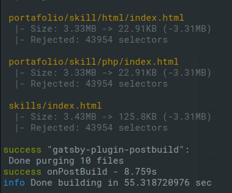

# Gatsby Postbuild
[![][npm-img]][npm-url] [![][ci-img]][ci-url] [![][gatsby-img]][gatsby-url] [![][license-img]][license-url]

Gatsby plugin for optimizing HTML/CSS files after build through:
- [x] Optimizing CSS files with [PurgeCSS](https://purgecss.com/) to remove unused CSS
- [x] Optimizing HTML files by removing unused inline CSS rules
- [ ] Minifying HTML/CSS files

The plugin works diffrently than other plugins/techniques that utilize [PurgeCSS](https://purgecss.com/) in conjunction
with [PostCSS](https://postcss.org/) to acheive the same goal. The main diffrence is that the plugin only runs after
Gatsby builds the site, then optimizes the generated HTML/CSS files.



---
- [How it works](#how-it-works)
- [Installation](#installation)
- [Quick Start](#quick-start)
- [Configuration](#configuration)
- [License](#license)


## How it works
The plugin uses [Parse5](https://github.com/inikulin/parse5) library to parse the generated HTML files into AST then:
- Removes all inline CSS defined in `<style>` tags
- Writes a temporary naked HTML files (without CSS)
- Optimizes both inline and external CSS by running PurgeCSS against the naked HTML files
- Serializes AST trees back to HTML using Parse5
- Writes optimized HTML/CSS files

## Installation
Install with [npm](https://www.npmjs.com/)
```sh
$ npm install --save gatsby-plugin-postbuild
```
or [yarn](https://yarnpkg.com/)
```sh
$ yarn add gatsby-plugin-postbuild
```


## Quick Start
Add the plugin to your `gatsby-config.js` and you're done, the plugin works well without any options

```javascript
plugins: [
  `gatsby-plugin-postbuild`,
]
```


## Configuration

### Defaults
Here is the list of options with their default values.

```javascript
// gatsby-config.js
plugins: [
  {
    resolve: `gatsby-plugin-postbuild`,
    options: {
      purgecss: {
        enabled: true,
        report: true,
        reportConsole: true,
        tailwind: false,
        // [...]
        // PurgeCss default options
        // See https://purgecss.com/configuration.html
      }
    }
  }
]
```

#### purgecss.enabled
> Type: `Boolean` Default: `true`

Whether to run the purgecss task or not.

#### purgecss.report
> Type: `Boolean` Default: `true`

Write a `purgecss.log.json` file in `/public` directory with all the changes made.

#### purgecss.reportConsole
> Type: `Boolean` Default: `true`

Print a summary report during build with all the changes made.

#### purgecss.tailwind
> Type: `Boolean` Default: `false`

Use custom extractor for tailwind.

#### purgecss.rejected
> Type: `Boolean` Default: `true`

Write a log file in `/public` directory with the rejected selectors for every file.

#### purgecss.defaultExtractor
> Type: `Function` Default: [`PurgeCSS.defaultExtractor`][purgecss-config]

A custom PurgeCSS extractor to be used instead of the default one.

#### purgecss.extractors
> Type: `Array` Default: [`PurgeCSS.extractors`][purgecss-config]

A list of custom PurgeCSS extractors to be used for certain file types.

#### purgecss.safelist
> Type: `(Array|Object)` Default: [`PurgeCSS.safelist`][purgecss-config]

Selectors that are safe to leave in the final CSS.

#### purgecss.blocklist
> Type: `Array|Object` Default: [`PurgeCSS.blocklist`][purgecss-config]

Selectors that are blocked from appearing in the final CSS.

#### purgecss.fontFace
> Type: `Boolean` Default: [`PurgeCSS.fontFace`][purgecss-config]

Remove any unused @font-face rules in your css.

#### purgecss.variables
> Type: `Boolean` Default: [`PurgeCSS.variables`][purgecss-config]

Remove any unused @keyframes rules in your css.

#### purgecss.keyframes
> Type: `Boolean` Default: [`PurgeCSS.keyframes`][purgecss-config]

Remove any unused variables in your css.


## License
[MIT][license-url]

[npm-url]: https://www.npmjs.com/package/gatsby-plugin-postbuild
[npm-img]: https://img.shields.io/npm/v/gatsby-plugin-postbuild.svg
[ci-url]: https://github.com/mohatt/gatsby-plugin-postbuild/actions
[ci-img]: https://img.shields.io/github/workflow/status/mohatt/gatsby-plugin-postbuild/CI/master
[gatsby-url]: https://www.gatsbyjs.org/packages/gatsby-plugin-postbuild
[gatsby-img]: https://img.shields.io/badge/gatsby-v2.25+-blueviolet.svg
[license-url]: https://github.com/mohatt/gatsby-plugin-postbuild/blob/master/LICENSE
[license-img]: https://img.shields.io/github/license/mohatt/gatsby-plugin-postbuild.svg
[purgecss-config]: https://purgecss.com/configuration.html
